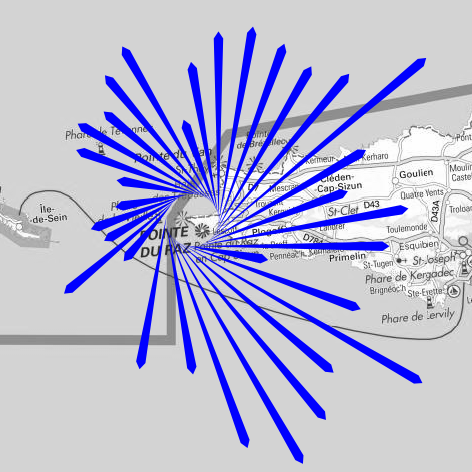
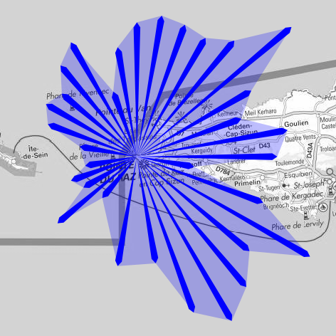
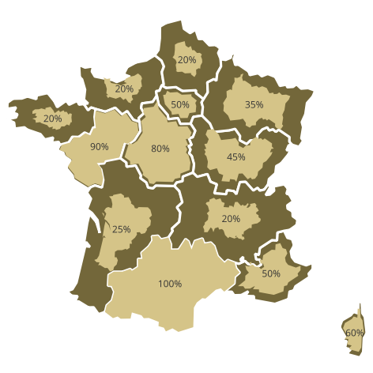

# qgis_personnal_styles
Collection of QGIS scripts to create amazing map visualizations

[The windrose "hurricane" style](hurricane_windrose/windrose_hurricane_lines_only_style.qml)

[The windrose "surfacic" style](hurricane_windrose/windrose_lines_and_surface_style.qml)

[The "scaled by proprortion" style](scaled_by_proportion/scaled_by_proportion_style.qml)

